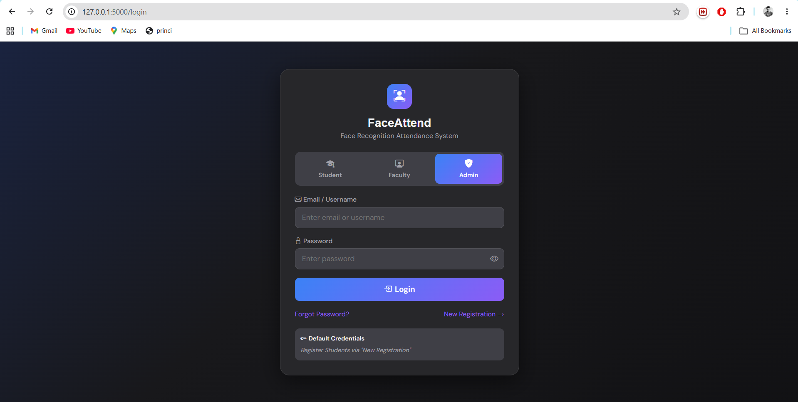
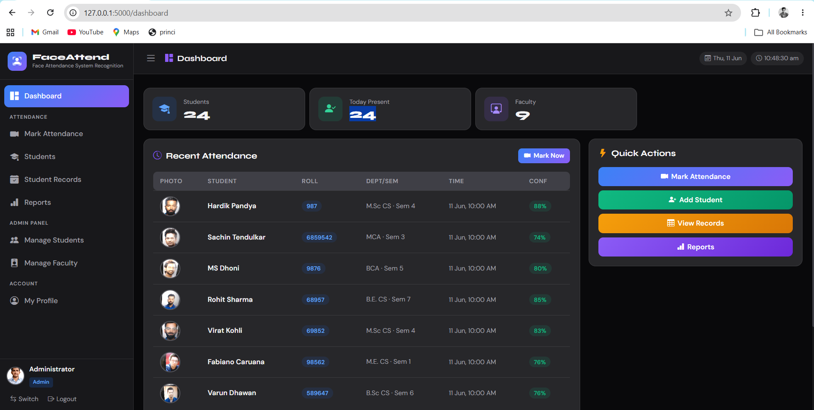
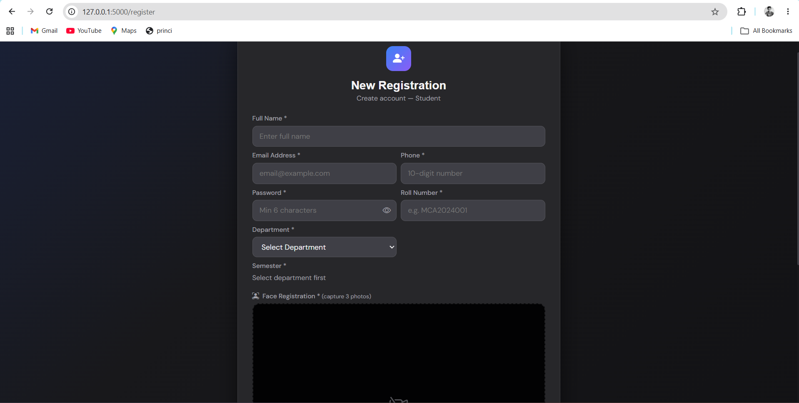
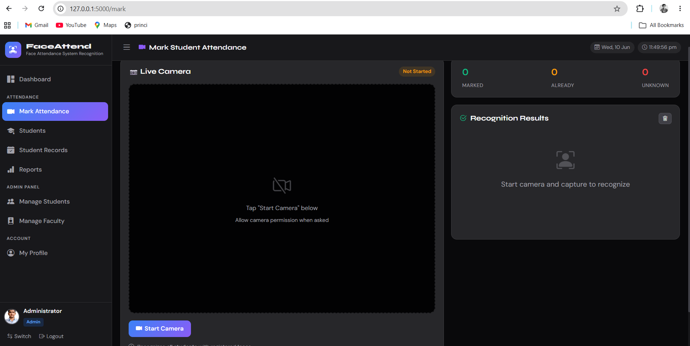
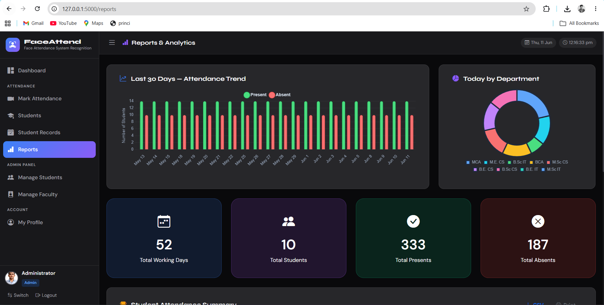
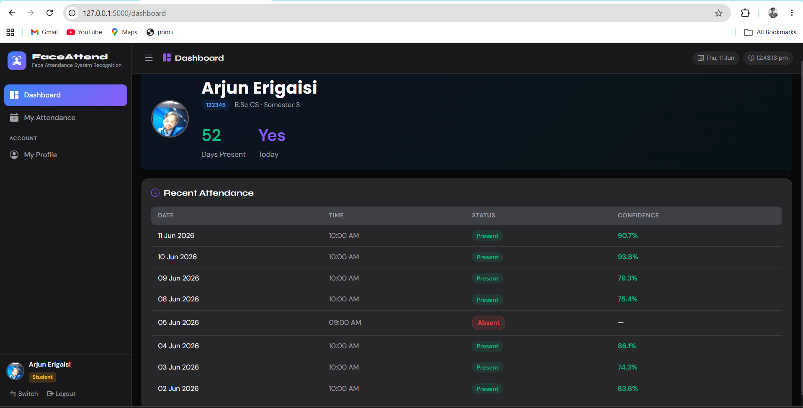

# 🎓 Face Attendance System using Face Recognition


A web-based **Face Attendance System** built using **Python, Flask, OpenCV, HTML, CSS, JavaScript, and SQLite**. The system automatically recognizes registered students through face recognition and records attendance securely, reducing manual effort and improving accuracy.

---

# 📌 Features

- 🔐 Admin Login
- 👨‍🎓 Student Registration
- 👨‍🏫 Faculty Management
- 📷 Face Registration
- 🤖 Face Detection & Recognition
- ✅ Automatic Attendance
- 📊 Attendance Reports
- 👤 Student Dashboard
- 📝 Student Attendance Records
- 🔑 Forgot & Reset Password
- 📱 Responsive User Interface

---

# 🛠️ Tech Stack

| Technology | Purpose |
|------------|---------|
| Python | Backend |
| Flask | Web Framework |
| OpenCV | Face Detection & Recognition |
| SQLite | Database |
| HTML5 | Frontend |
| CSS3 | Styling |
| JavaScript | Client-side Functionality |

---

# 📷 Project Screenshots

## 🔐 Admin Login



---

## 👨‍💼 Admin Dashboard



---

## 👨‍🎓 Student Registration



---

## 📸 Face Attendance



---

## 📊 Attendance Reports



---

## 👨‍🎓 Student Dashboard



---

# 📂 Project Structure

```text
Face-Attendance-System/
│
├── app.py
├── requirements.txt
├── schema.sql
├── README.md
├── screenshots/
├── static/
├── templates/
├── database/
└── instance/
```

---

# ⚙️ Installation

### Clone the repository

```bash
git clone https://github.com/qureshisohel/face-attendance-system.git
```

### Move into the project

```bash
cd face-attendance-system
```

### Create Virtual Environment

```bash
python -m venv venv
```

### Activate Virtual Environment

**Windows**

```bash
venv\Scripts\activate
```

**Linux / macOS**

```bash
source venv/bin/activate
```

### Install Dependencies

```bash
pip install -r requirements.txt
```

### Run the Application

```bash
python app.py
```

---

# 🚀 Future Improvements

- Deep Learning based Face Recognition
- Email Notifications
- Cloud Database Integration
- Mobile Application
- Multi-Camera Support
- Attendance Analytics Dashboard
- QR + Face Hybrid Attendance

---

# 📖 How It Works

1. Admin logs into the system.
2. Register students and capture their face images.
3. Store facial data securely.
4. Recognize faces through the webcam.
5. Automatically mark attendance.
6. Generate attendance reports.
7. Students can view their attendance history.

---

# 👨‍💻 Author

**Qureshi Mohammadsohel**

🎓 MCA Student

📍 Ahmedabad, Gujarat, India

### 🌐 Connect with Me

- GitHub: https://github.com/qureshisohel
- Portfolio: https://sohel-qureshi.vercel.app
- LinkedIn: https://linkedin.com/in/sohel-qureshi-9536a4223

---

# ⭐ Support

If you found this project helpful, please consider giving it a **⭐ Star** on GitHub.

---

## 📄 License

This project is created for educational and learning purposes.